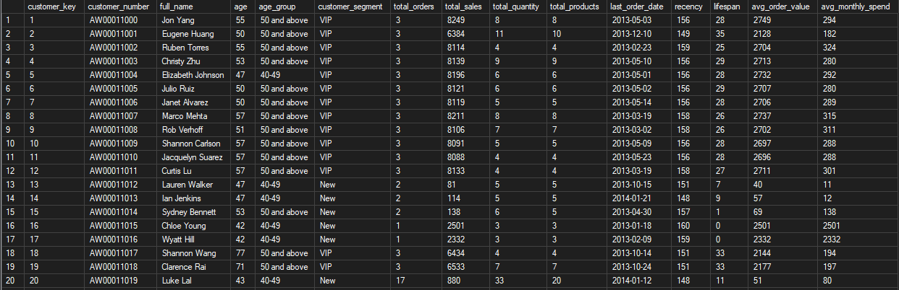
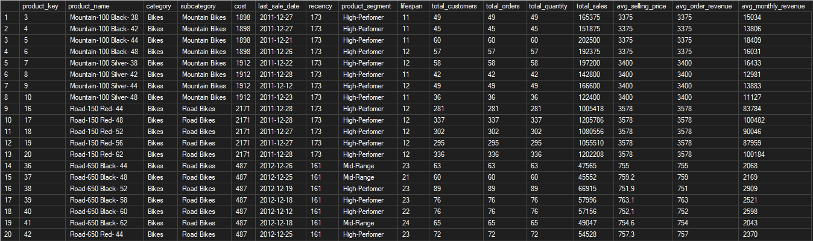
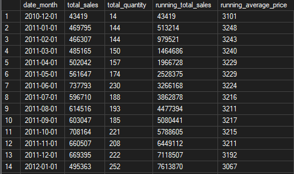

# SQL Data Analysis Project

A SQL Server portfolio project focused on exploratory analysis, KPI reporting, trend analysis, segmentation, ranking, and reusable customer/product reporting views.

This repository demonstrates how to turn cleaned warehouse data into meaningful insights using SQL queries, window functions, aggregations, ranking techniques, and reusable customer/product reporting views.

---

## 📋 Project Overview

This project demonstrates a practical SQL analytics workflow built for portfolio presentation and real-world reporting.

It includes:

1. Data exploration
2. Trend analysis
3. Ranking analysis
4. Segmentation analysis
5. Part-to-whole analysis
6. Reusable reporting views

---

## 🗂️ Data Foundation

This project is based on the `gold` layer of a SQL Server data warehouse.

Main tables used:

- `gold.fact_sales`
- `gold.dim_customers`
- `gold.dim_products`

---

## 🧱 Project Structure

```text
sql-data-analysis-project/
├── datasets/
│    ├── dim_customers.csv
│    ├── dim_products.csv
│    └── fact_sales.csv
│
├── docs/
│   └── images/
│       ├── customer_report.png
│       ├── product_report.png
│       └── cumulative_analysis.png
│
├── scripts/
│   ├── change_over_time_analysis.sql
│   ├── cumulative_analysis.sql
│   ├── data_segmentation.sql
│   ├── date_range_exploration.sql
│   ├── magnitude_analysis.sql
│   ├── measures_exploration.sql
│   ├── part_to_whole_analysis.sql
│   ├── performance_analysis.sql
│   ├── ranking_analysis.sql
│   ├── report_customers.sql
│   └── report_products.sql
└── README.md
```

---

## 🔍 Analysis Scripts

### 1. Date Range Exploration
  Finds the first and last order dates and checks the customer birthdate range.

### 2. Measures Exploration
  Calculates core business metrics such as total sales, quantity, average price, total orders, total products, and total customers.

### 3. Magnitude Analysis
  Shows how sales, customers, and products are distributed by country, gender, category, and customer.

### 4. Ranking Analysis
  Identifies top and bottom performers across products and customers using ranking techniques.

### 5. Change Over Time Analysis
  Analyzes sales, quantity, and customer trends by month and year.

### 6. Cumulative Analysis
  Measures running totals and cumulative performance over time.

### 7. Performance Analysis
  Compares yearly product performance against previous years and average sales.

### 8. Data Segmentation
  Groups products and customers into meaningful business segments.

### 9. Part-to-Whole Analysis
  Measures how much each category contributes to overall sales.

### 10. Customer Report
  Creates a reusable customer reporting view with metrics such as segment, age group, recency, lifespan, average order value, and average monthly spend.

### 11. Product Report
  Creates a reusable product reporting view with metrics such as product segment, recency, lifespan, average selling price, average order revenue, and average monthly revenue.

---

## ⚙️ Features

- SQL Server-based analysis
- Window functions
- CTE-based query organization
- Business-focused segmentation
- Reusable customer and product views
- Clear comments and sections headers
- Portfolio-friendly structure

---

## 🖼️ Visuals

### Customer Report

This screenshot shows the output of the customer reporting view.



### Product Report

This screenshot shows the output of the product reporting view.



### Cumulative Analysis

This screenshot shows the cumulative trend analysis output.



---

## 🛠️ Prerequisites

- Microsoft SQL Server
- SQL Server Management Studio or Azure Data Studio
- A database containing the `gold` schema


---

## 🚀 How to Use

1. Open the SQL scripts in your SQL client.
2. Run the exploration queries first.
3. Run the ranking, trend, cumulative and segmentation queries.
4. Create the customer and product reporting views.
5. Use the outputs for portfolio screenshots or BI dashboards.

---

## ℹ️ Important Note

Some queries use functions such as `DATETRUNC`, `DATEDIFF`, `LAG`, `RANK`, and `FORMAT`, which may behave differently depending on your SQL Server version.

---

## 👤 Author

**Václav Benda**


